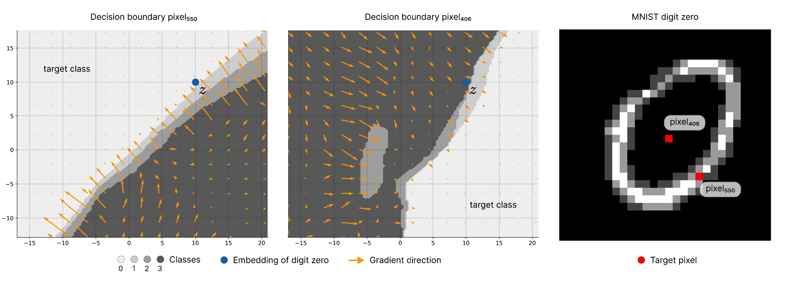

# Contrastive Abductive Knowledge Extraction (CAKE) on Autoencoders



Contrastive Abductive Knowledge Extraction (CAKE) (Braun et al., 2024)
enables data-free distillation by generating synthetic samples
that probe a teacher’s decision boundary via contrastive diffusion. 

This repository empirically shows that CAKE fundamentally fails in autoencoders because the shared latent manifold strictly constrains optimization. For a theoretical explanation refer to the preprint "On the Failure of Boundary-Seeking Distillation in Bottlenecked Generative Architectures" by **Mohamed Amine Kina**.

To read: [Preprint - Mohamed Amine Kina](./Preprint%20-%20Mohamed%20Amine%20Kina.pdf)

The pipeline is primarily built and tested around an Autoencoder architecture acting on the MNIST dataset, with pixel-wise classification tasks.


## Pipeline Architecture


1. **Stage 1: Teacher Training (`1-training-teacher-model`)**
   - Trains a foundational Teacher Autoencoder.
   - For MNIST, it uses a custom **Dynamic Foreground Binning** transformer that categorizes pixels into absolute black (0) and multiple foreground brightness bins (1, 2, 3).
   - Outputs pre-trained teacher weights (e.g., `mnist_4class_autoencoder.pth`).

2. **Stage 2: Synthetic Data Generation (`2-synthetic-data-generation`)**
   - Generates synthetic "distillation samples" directly from the frozen Teacher model.
   - Employs gradient-based or iterative optimization of raw noise (or specific initializations) guided by classification, contrastive, and total variation (TV) loss objectives.
   - The primary orchestrator is `runner.py`, which integrates Weights & Biases (W&B) for hyperparameter sweeps and tracks sample generation.

3. **Stage 3: Student Distillation & Evaluation (`3-distillation-and-evaluation`)**
   - Trains a Student Autoencoder exclusively on the synthetic pixel samples.
   - Uses a pixel-wise knowledge distillation loss consisting of both hard cross-entropy and soft Kullback-Leibler (KL) divergence against the Teacher's predictions.
   - Evaluates the Student against the Teacher on the real test set by comparing the foreground mean Intersection over Union (mIoU).


## Usage

### 1. Training the Teacher Model
If you need to train the teacher model from scratch:
```bash
python 1-training-teacher-model/autoencoder.py
```

### 2. End-to-End Orchestration
The primary entry point for running the synthetic generation and student distillation is the second-stage runner. It handles loading the Teacher, generating samples, training the Student, and returning the final evaluation metric.

**Run a standard experiment:**
```bash
python 2-synthetic-data-generation/runner.py
```

**Run an iterative sampling mode (e.g., passing noise through the teacher 50 times):**
```bash
python 2-synthetic-data-generation/runner.py --mode iterations --iterations 50
```

**Run a Hyperparameter Optimization Sweep (via Weights & Biases):**
```bash
python 2-synthetic-data-generation/runner.py --sweep
```

*(Additional options include `--filter-empty`, `--sweep-id <ID>`, and specific sampling `--mode` configurations. Use `python 2-synthetic-data-generation/runner.py --help` for full details).*


## Configuration

The project uses **Hydra** combined with `OmegaConf` for robust configuration management. All core hyperparameters (for Teacher, Student, Sampling algorithms, and Optimizers) are defined in `config.yaml` located at the root of the repository.

- **`sampling`**: Defines learning rates, Langevin dynamics toggles, and specific loss weights (e.g., `weight.cls`, `weight.contr`, `weight.tv`).
- **`teacher` & `student`**: Allow swapping out architectures (e.g., `mlp`, `resnet`, `cnn`, `vit`) and corresponding architectural parameters dynamically.
- **`run`**: Enables toggling individual stages (`teacher`, `sampling`, `student`) on or off.

## Visualizations and Experiments

- `folder_viz`: Contains scripts to visualize outputs, plot 2D latent projections, compare model boundaries, and evaluate experiments.
- `folder_exp`: Contains standalone experiment scripts (e.g., analyzing gradient conflicts, latent trajectories).
- `documentation`: Contains pedagogical scripts like `teacher_forward_example.py` to demonstrate the pipeline components natively.
